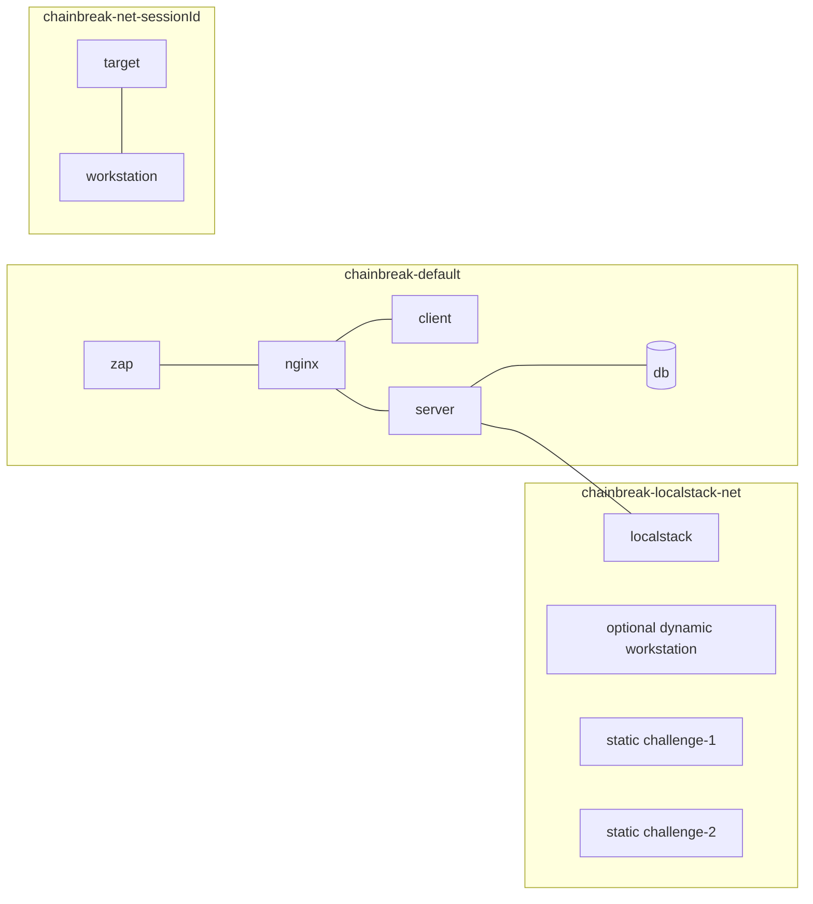
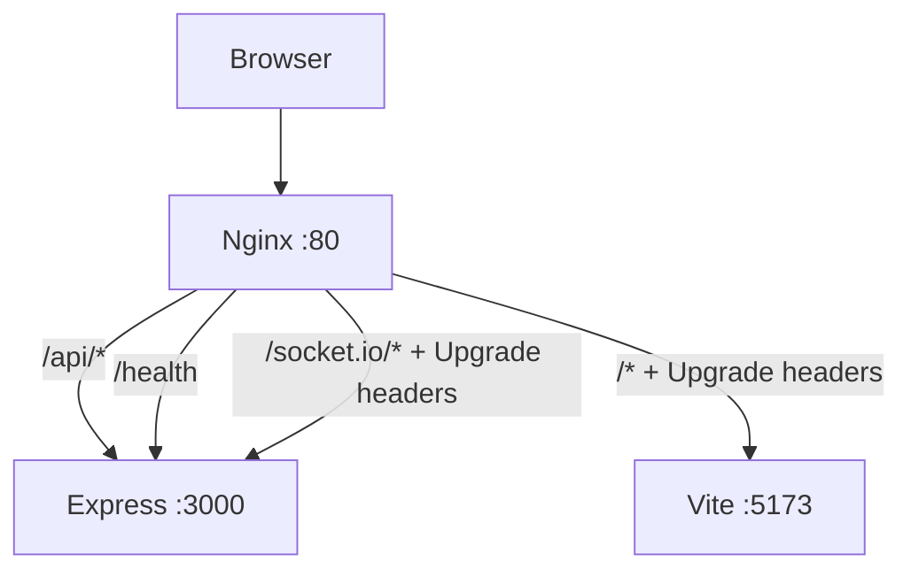
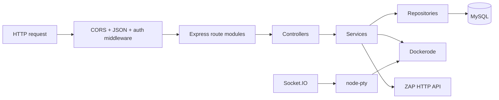
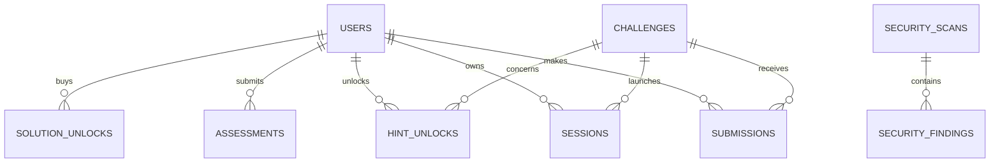
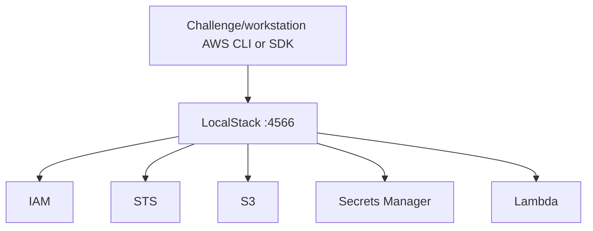
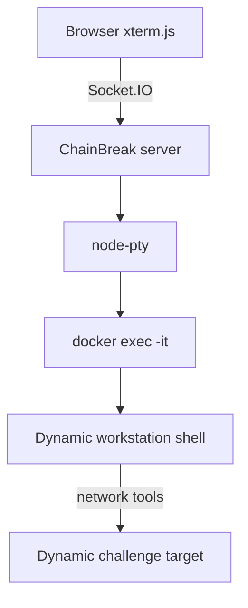
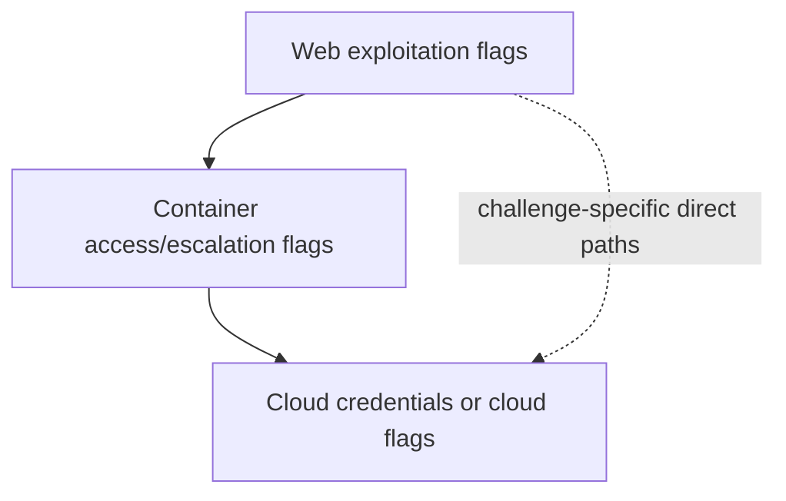
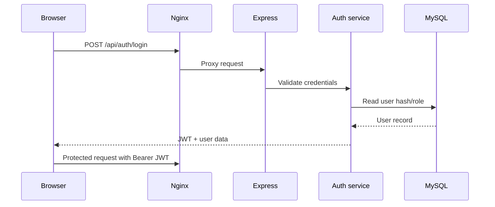
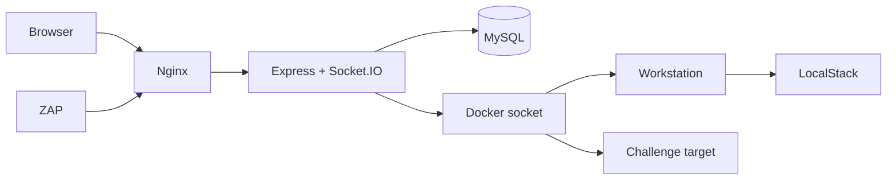

# ChainBreak Architecture

_Repository-verified architecture reference. Updated 2026-09-05._

This document describes the implementation currently present in the repository. Statements marked **Implemented**, **Partially implemented**, or **Proposed** are deliberate: the codebase is the source of truth, and planned dissertation features are not presented as operational features.

## 1. System Overview

ChainBreak is a **Dockerised, tri-layer cybersecurity education and Capture-the-Flag (CTF) platform**. It combines browser-based challenge workflows, isolated per-session Docker environments, an interactive terminal, progressive flags, AI-assisted hints, research assessments, and an administrator-only OWASP ZAP Security Centre.

The intended learning model is a multi-stage attack chain:

```text
Layer 1: Web/application exploitation
              |
              v
Layer 2: Container compromise and container security
              |
              v
Layer 3: Cloud/AWS misconfiguration and abuse
```

The repository implements this model to different degrees by challenge. Challenge 1 and Challenge 2 contain web, container, and LocalStack/cloud material, but not every flag is reachable through one identical progression. LocalStack is a simulated AWS environment, not production AWS infrastructure.

### Architectural goals

- Provide reproducible, disposable vulnerable environments for cybersecurity education.
- Separate the learner workstation from the vulnerable target using per-session networks.
- Make flags, scores, hints, solution unlocks, and assessment responses persistent.
- Support an immersive browser terminal backed by a real PTY and Docker `exec`.
- Expose the current research state through pre/post assessment instruments and scan evaluation.
- Keep intentionally vulnerable challenge code separate from the platform's authentication and administrative controls.

## 2. High-Level Architecture

```mermaid
flowchart TD
    U[User] --> B[Browser]
    B --> N[Nginx :80]
    N --> C[React/Vite client :5173]
    N --> S[Express/Socket.IO server :3000]
    S --> DB[(MySQL 8 chainbreak)]
    S --> DE[Docker Engine API\n/var/run/docker.sock]
    DE --> T[Per-session challenge target]
    DE --> W[Per-session workstation]
    W --> LS[LocalStack :4566\noptional shared network attachment]
    T --> LS
    S --> Z[OWASP ZAP :8080\ninternal Compose network]
    Z --> N
    LS --> AWS[AWS-compatible APIs\nS3, IAM, STS, Secrets Manager, Lambda]
    B -. Socket.IO/WebSocket .-> N
    N -. /socket.io/ .-> S
```

The normal browser path is through Nginx. The backend also creates dynamic challenge containers and networks through Dockerode. ZAP is a separate Compose service and is reached by the backend at `http://zap:8080`; it is not published on the host and is not proxied by Nginx.

## 3. Technology Stack

| Area | Implemented technology | Evidence |
|---|---|---|
| Frontend | React 19, Vite, React Router, Tailwind CSS | `client/package.json`, `client/src/App.jsx` |
| Client data/API | Axios, TanStack Query | `client/src/services/api.js`, `client/src/hooks` |
| Terminal UI | xterm.js, FitAddon, Socket.IO client | `client/src/components/terminal/Terminal.jsx` |
| Kill-chain visualisation | React Flow | `client/package.json`, challenge components |
| Backend | Node.js, Express 5, native ES modules | `server/package.json`, `server/app.js` |
| Real-time transport | Socket.IO and `node-pty` | `server/socket` |
| Database | MySQL 8 with `mysql2/promise` | `server/db`, `server/db/connection.js` |
| Container control | Dockerode plus Docker Engine socket | `server/services/docker.service.js` |
| Cloud simulation | LocalStack Community | `docker-compose.yml`, `LocalStack/` |
| Web scanner | OWASP ZAP API and Docker image | `docker-compose.yml`, `server/services/security.service.js` |
| Authentication | JWT, bcrypt | `server/services/auth.service.js`, auth middleware |
| AI hints | Anthropic API when configured, fallback hints otherwise | `server/services/ai.service.js`, `hint.service.js` |
| Nuclei | Not implemented | No dependency, image, service, or integration found |
| Trivy | Not implemented | No dependency, image, service, or integration found |

## 4. Docker Architecture

The root `docker-compose.yml` defines the long-running platform services. The `workstation` service is build-only; actual learner workstations are created dynamically by the backend.

| Service | Image/build | Purpose | Ports | Networks | Volumes/dependencies |
|---|---|---|---|---|---|
| `nginx` | `nginx:1.25-alpine` | Public reverse proxy | Host `80:80` | `chainbreak-default` | Read-only Nginx config; depends on `client` and `server` |
| `client` | `client/Dockerfile` | Vite development frontend | Internal `5173` | `chainbreak-default` | `./client:/app`, `client-node-modules` |
| `server` | `server/Dockerfile` | Express API, Socket.IO, Docker orchestration | Internal `3000` | default, LocalStack, both challenge networks | `./server:/app`, `server-node-modules`, host Docker socket; waits for healthy `db` |
| `zap` | `ghcr.io/zaproxy/zaproxy:stable` | Internal OWASP ZAP daemon | Internal `8080` only | `chainbreak-default` | 2 GB Compose deploy memory limit; no host port |
| `db` | `mysql:8.0` | Persistent application/research data | Host `3306:3306` | `chainbreak-default` | `mysql-data`, initial `schema.sql`, MySQL healthcheck |
| `localstack` | `localstack/localstack:3` | Simulated AWS services | Internal `4566` | `chainbreak-localstack-net` | `localstack-data`, `./LocalStack` init hooks; healthcheck |
| `challenge-1` | `challenges/challenge-1/web/Dockerfile` | Static Compose target/reference image | Internal `3000`, SSH `22` | challenge-1 and LocalStack networks | `privileged: true`; waits for healthy LocalStack |
| `challenge-2` | `challenges/challenge-2/Dockerfile` | Static Compose target/reference image | Internal `3000` | challenge-2 and LocalStack networks | Mounts Docker socket; no LocalStack dependency |
| `workstation` | `server/docker/workstation/Dockerfile` | Build-only image for dynamic attacker workstations | None | Attached dynamically | `build-only` profile; image `chainbreak-workstation` |

### Static versus dynamic challenge containers

The Compose `challenge-1` and `challenge-2` services are useful for direct development and inspection. Gameplay uses `server/services/docker.service.js`: a session creates a target container from the challenge image, a workstation container from `chainbreak-workstation`, and a private bridge network named `chainbreak-net-<sessionId>`.

Dynamic containers receive memory, CPU, swap, and PID limits from configuration. The target receives a stable hostname/network alias such as `web-challenge-1`; the workstation is named `chainbreak-ws` and is attached as `workstation`.

The server mounts `/var/run/docker.sock`, which is a highly privileged control boundary. Challenge 2 also mounts the Docker socket in the root Compose definition, although the current Challenge 2 application documents sudo/find privilege escalation rather than using that socket. This mismatch is a confirmed architectural inconsistency.

## 5. Docker Networking

| Network | Services/containers | Purpose |
|---|---|---|
| `chainbreak-default` | Nginx, client, server, db, zap | Main application and scanner network |
| `chainbreak-localstack-net` | LocalStack, server, static challenges, optionally dynamic workstations | Shared cloud simulation network; explicit stable Docker name |
| `challenge-1-net` | Server and static Challenge 1 | Challenge 1 development network |
| `challenge-2-net` | Server and static Challenge 2 | Challenge 2 development network |
| `chainbreak-net-<sessionId>` | Dynamic target and workstation | Per-learner isolation; created and removed by Dockerode |



Host-accessible addresses differ from Docker-internal service discovery. A host browser uses `http://localhost` for Nginx and `localhost:3306` for published MySQL. Containers use names such as `http://nginx`, `http://server:3000`, and `http://localstack:4566`. ZAP targets `http://nginx`, not `http://localhost`.

ZAP can reach Nginx because both are on `chainbreak-default`. A dynamically provisioned target is not automatically on that network; it is normally reachable through its private session network. Therefore ZAP assesses the Nginx/application ingress path, not arbitrary per-session challenge containers.

## 6. Reverse Proxy Architecture

`nginx/nginx.conf` listens on port 80 and routes:



- `/api/` is proxied to `server:3000`.
- `/health` is proxied to `server:3000`.
- `/socket.io/` is proxied to Express with WebSocket upgrade headers.
- `/` is proxied to `client:5173`; upgrade headers are also present for development tooling.

The frontend uses `/api` as its Axios base URL, so browser requests normally follow the Nginx path.

## 7. Frontend Architecture

The entry point is [client/src/main.jsx](client/src/main.jsx). [client/src/App.jsx](client/src/App.jsx) composes `QueryClientProvider`, `AuthProvider`, `BrowserRouter`, protected routes, and `AppLayout`.

### Routes

| Route | Protection | Implementation |
|---|---|---|
| `/login` | Public | Login |
| `/register` | Public | Registration |
| `/dashboard` | Authenticated | Learner dashboard |
| `/challenge/:id` | Authenticated | Challenge workspace and terminal |
| `/challenge/:id/solution` | Authenticated | Solution walkthrough |
| `/scoreboard` | Authenticated | Leaderboard |
| `/assessment` | Authenticated | Knowledge/confidence/SUS assessment |
| `/admin/security` | Admin | Security Centre |
| `/progress`, `/hints`, `/components`, `/settings` | Authenticated | Current placeholder pages |
| `/admin/*` | Admin | Current placeholder admin panel |

Major frontend areas include dashboard cards, challenge mission briefs, kill-chain components, terminal/xterm UI, flag rows, hint panels, solution pages, scoreboard components, assessment screens, and the Security Centre. TanStack Query handles server-state hooks such as challenges and scores; local React state is used in pages such as the Security Centre and terminal.

`AuthContext` stores the JWT and user in `sessionStorage` and restores the user through `/api/auth/me`. Axios attaches `Authorization: Bearer <token>` to API requests. `ProtectedRoute` and `AdminRoute` enforce browser navigation gates; the backend remains the authoritative security boundary.

### Security Centre UI

The admin Security Centre at `/admin/security` displays real persisted scan data: score when available, severity counts, OWASP mapping counts, web-layer findings, research metadata, filters, finding search, scan history, and empty/error states. It explicitly renders container and cloud coverage as not assessed by ZAP.

## 8. Backend Architecture

`server/server.js` starts the HTTP server and Socket.IO; `server/app.js` configures CORS, JSON parsing, `/health`, `/api`, 404 handling, and centralized errors.



### Backend route groups

| Method | Endpoint | Purpose | Authentication |
|---|---|---|---|
| POST | `/api/auth/register` | Register user | Public |
| POST | `/api/auth/login` | Issue JWT | Public |
| GET | `/api/auth/me` | Return current user | JWT |
| POST | `/api/auth/logout` | Logout route; no server-side token revocation | Public route |
| GET | `/api/health` | API health response | Public |
| GET | `/api/challenges` | List challenges, optional layer filter | JWT |
| GET | `/api/challenges/:id` | Challenge detail | JWT |
| GET | `/api/challenges/:id/progress` | Challenge/module progress | JWT |
| GET/POST | `/api/challenges/:id/solution-unlock` | Solution status/unlock | JWT |
| GET/POST | `/api/challenges/:id/hints` | Hint status/reveal | JWT |
| POST | `/api/challenges/:id/start` | Start a challenge session | JWT |
| POST/DELETE | `/api/sessions/challenges/:id/session` | Start/stop session | JWT |
| POST | `/api/flags` | Submit a flag | JWT |
| GET | `/api/scores/me` | Current score | JWT |
| GET | `/api/scores/leaderboard` | Leaderboard | JWT |
| POST | `/api/assessment` | Submit assessment | JWT |
| GET | `/api/assessment/mine` | Retrieve own assessments | JWT |
| GET | `/api/hints/research` | Cross-user hint export | JWT + admin |
| POST/DELETE | `/api/challenges` and `/api/challenges/:id` | Admin challenge operations | JWT + admin |
| GET | `/api/security/zap/status` | ZAP configuration status | JWT + admin |
| POST | `/api/security/zap/scan` | Start controlled ZAP scan | JWT + admin |
| GET | `/api/security/zap/scans` | Scan history | JWT + admin |
| GET | `/api/security/zap/scans/:id` | Scan record | JWT + admin |
| GET | `/api/security/zap/scans/:id/findings` | Persisted findings | JWT + admin |
| GET | `/api/security/zap/scans/:id/evaluation` | Ground-truth evaluation | JWT + admin |
| GET | `/api/security/zap/owasp` | OWASP category metadata | JWT + admin |
| GET | `/api/security/zap/ground-truth` | Ground-truth metadata | JWT + admin |
| GET | `/api/security/zap/evaluation` | Layer limitations metadata | JWT + admin |

### Middleware and security controls

- JWTs are verified by `server/middleware/auth.js` using `JWT_SECRET`.
- `requireAdmin` checks `req.user.role === 'admin'` after authentication.
- Passwords and challenge flags are stored/compared using bcrypt.
- Security Centre target validation accepts only the configured controlled HTTP `nginx` target.
- ZAP is not directly exposed through Nginx or a host port.
- The application has CORS configuration, centralized error handling, request JSON parsing, and an in-memory hint rate limit.
- The Docker socket is a necessary but highly privileged server boundary for dynamic challenge provisioning.

Logging is mixed: the shared logger is used by several services, while direct console logging remains in some session, socket, and challenge paths.

## 9. Database Architecture

MySQL 8 stores platform, learning, and Security Centre data. The schema is in [server/db/schema.sql](server/db/schema.sql). Existing databases require migration files in `server/db/`; Compose does not automatically execute all migrations against an already-populated volume.



| Table | Purpose |
|---|---|
| `users` | Username, email, bcrypt password hash, role, creation time |
| `challenges` | Challenge catalogue, layer, category, difficulty, bcrypt flag hash, points, image, network alias |
| `submissions` | Correct and incorrect flag attempts linked to users/challenges |
| `sessions` | Learner session, target/workstation/network IDs, status and TTL |
| `assessments` | Pre/post answers, web/container/cloud scores, confidence ratings, SUS responses and SUS score |
| `solution_unlocks` | One-time paid solution unlocks per user/module |
| `hint_unlocks` | Per-user/challenge/tier hint reveals, cost, generated text, source and timestamp |
| `security_scans` | Target, scan type/status, timestamps, phases, discovered URL counters, severity totals, score and failure message |
| `security_findings` | Normalised ZAP alert, evidence, endpoint, risk, OWASP mapping, layer and ground-truth status |

Flags are not stored as plaintext in `challenges`; only bcrypt hashes are persisted. Static target-image environment values and seed definitions must remain synchronised, which is a current limitation.

## 10. Authentication and Authorisation

Platform authentication uses registration/login and bearer JWTs. The JWT contains user identity and role; the frontend stores it in `sessionStorage`, while the backend verifies it on protected routes. Role values are `participant` and `admin`.

Socket.IO performs a separate handshake check: it verifies the JWT, loads the requested session, confirms ownership, and requires `status = 'running'`. This protects the terminal from unauthorised access to another user's session.

Challenge applications have their own intentionally vulnerable authentication mechanisms. Challenge 1 has SQL-injection-prone login logic, while Challenge 2 has weak support authentication and a weak JWT secret. These are challenge vulnerabilities, not the platform's JWT implementation.

## 11. Challenge Architecture

### Challenge 1

Challenge 1 is built from `challenges/challenge-1/web/Dockerfile`, `app.js`, `entrypoint.sh`, a compiled SUID helper, SSH configuration, and backup material. Its static Compose service is privileged, but the dynamically provisioned target itself is created by Dockerode without the Compose `privileged: true` setting.

Implemented attack stages:

1. **SQL injection** in `POST /login` through string-concatenated SQLite input.
2. **Broken access control** in `GET /api/users`, where authentication is checked but role is not.
3. **Path traversal/backup disclosure** in `GET /api/admin/backup?file=...`.
4. **Credential/SSH pivot** using challenge-provided key material.
5. **SUID privilege escalation** through the root-owned `backup-helper` and `/root/flag.txt`.
6. **Cloud bridge** through root-only AWS credentials for the LocalStack IAM/S3 scenario.

The seeded Challenge 1 rows cover SQL injection, SSH pivot, leaked AWS credentials, SUID escalation, container misconfiguration, broken access control, and the AWS IAM/S3 stage. Plaintext flags are intentionally omitted here.

### Challenge 2

Challenge 2 is built from `challenges/challenge-2/Dockerfile`, `app.js`, and `entrypoint.sh`. Its current application implementation differs from older documentation and from some stale Compose environment names.

Implemented application vulnerabilities:

- Insecure deserialisation/RCE through the base64 `profile` cookie using `node-serialize`.
- Verbose stack/error disclosure from the malformed-cookie path.
- Weak support login with no lockout or rate limiting.
- Weak HS256 JWT secret enabling offline cracking and forged admin claims.

Implemented container/cloud progression:

- Passwordless sudo for `/usr/bin/find` enables root escalation.
- Root-only files include a CI credential file and container flag material.
- The CI credentials begin a two-hop LocalStack Secrets Manager chain.

Confirmed inconsistencies:

- Root Compose still sets legacy `FLAG_1`, `FLAG_2`, and `FLAG_3` names associated with an older design; the current provisioning path uses `FLAG_RCE`, `FLAG_ERRORLEAK`, `FLAG_PRIVESC`, `FLAG_WEAKAUTH`, `FLAG_JWTFORGE`, and CI credential variables.
- Compose mounts the Docker socket into Challenge 2, but the current documented challenge path uses sudo/find and does not use the socket.
- Challenge 2 package metadata/start configuration should be reconciled with the Dockerfile's actual entrypoint behavior; the repository audit found metadata referring to `server.js` while the application file is `app.js`.

## 12. OWASP Top 10 Mapping

| Challenge evidence | OWASP 2021 mapping | Layer | Notes |
|---|---|---|---|
| Challenge 1 SQL query concatenation | A03 Injection | Web | Direct mapping |
| Challenge 1 missing role check | A01 Broken Access Control | Web | Direct mapping |
| Challenge 1 path traversal/backup exposure | A01 Broken Access Control | Web | Defensible; scanner mapping is approximate |
| Challenge 1 leaked/weak credentials | A07 or A05 depending on mechanism | Web/container | Context-dependent |
| Challenge 2 insecure deserialisation dependency | A08 Software and Data Integrity Failures / vulnerable component context | Web | ZAP may not exercise RCE |
| Challenge 2 verbose error disclosure | A05 Security Misconfiguration | Web | Approximate taxonomy |
| Challenge 2 weak login/no lockout | A07 Identification and Authentication Failures | Web | Direct conceptual mapping |
| Challenge 2 weak JWT secret | A02 Cryptographic Failures | Web | Direct conceptual mapping |
| SUID/sudo/container configuration | Not directly represented by OWASP Top 10 (2021) | Container | Container-specific assessment required |
| IAM/S3/Secrets Manager misconfiguration | Not directly represented by OWASP Top 10 (2021) | Cloud | AWS/LocalStack-specific assessment required |

The Security Centre mapping layer labels scanner mappings as `direct`, `approximate`, or `not_mapped`. It does not force every challenge vulnerability into an OWASP category.

## 13. Container Security Layer

The container layer is implemented through Docker configuration and challenge files rather than ZAP. Relevant elements include:

- Server access to the host Docker socket for provisioning and teardown.
- Dynamic target/workstation pairs on isolated per-session networks.
- Resource controls for memory, CPU and process count.
- Challenge 1 privileged static Compose configuration and SUID/root-file paths.
- Challenge 2 passwordless sudo/find escalation and a static Compose Docker-socket mount that is not currently used by the app code.
- Root-only credential and flag files used to bridge into the cloud layer.

The Docker socket and `privileged` settings are infrastructure used to create the educational scenario; they are also high-impact security boundaries. No Trivy or equivalent image/configuration scanner exists in the repository.

## 14. Cloud and LocalStack Layer

LocalStack is configured with S3, IAM, STS, Secrets Manager, and Lambda. Init scripts under [LocalStack](LocalStack) seed resources on the ready hook.



Challenge 1 seeds a deploy-bot identity, credentials, the `acme-payments-backups` bucket, objects, and an intentionally over-broad bucket policy. Challenge 2 seeds a CI runner identity, an admin identity, a deploy-key secret containing stronger credentials, and a production master secret containing the cloud flag.

The backend attaches a dynamic workstation to the stable LocalStack network on a best-effort basis. The target itself is not attached by `docker.service.js`; cloud reachability therefore depends on the workstation attachment and current challenge workflow. LocalStack Community does not provide production-equivalent IAM policy enforcement, so policy documents are inspectable research artefacts rather than proof of AWS-equivalent authorisation.

## 15. Workstation and Terminal Architecture



The workstation image is built from `server/docker/workstation/Dockerfile` and includes exercise tooling. The browser sends terminal input and dimensions through Socket.IO. The server authenticates the session, detects bash where available, starts a PTY using a direct argument array, forwards output, and cleans up the PTY on disconnect.

Terminal output is scanned for the `flag{...}` pattern. Candidate values are compared against bcrypt hashes for the module's challenge IDs through the flag service. Correct first-time captures create submissions, award points, and broadcast score updates. SSH output is included because it returns through the workstation PTY.

Known lifecycle limitations include a reaper room-disconnect call for rooms that sockets do not currently join, no frontend invocation of the implemented stop-session endpoint, and possible stale provisioning records after an unexpected server failure despite reconciliation helpers.

## 16. Security Assessment Architecture

### OWASP ZAP integration

ZAP is implemented as an internal Compose daemon. The backend:

1. Validates that the requested target equals the configured controlled target and resolves to internal `http://nginx`.
2. Creates a scan record in `security_scans`.
3. Creates a ZAP session/context and includes the target URL.
4. Runs the traditional spider.
5. Runs the AJAX spider to discover client-side routes.
6. Runs active scanning for `full` and currently also for the accepted `api` scan type.
7. Polls progress and updates scan phases.
8. Reads ZAP alerts, normalises risk/confidence/evidence, applies the OWASP mapping layer, and stores rows in `security_findings`.
9. Stores severity counts, endpoint/URL counters, and the deterministic score.

The backend communicates with ZAP through `ZAP_API_KEY`, `ZAP_URL`, and `ZAP_TARGET`. ZAP has no host-published API/UI port in Compose.

The accepted scan types are `passive`, `full`, and `api`. **Partially implemented:** `api` is accepted as a label but does not perform an OpenAPI import or API-specific context setup; it follows the non-passive active-scan path. No authenticated ZAP context for ChainBreak JWT-protected routes is implemented.

### Ground truth and evaluation

`server/lib/securityCentre.js` defines eleven documented evidence items: seven web-layer items and container/cloud items that ZAP is not expected to assess. This catalogue is separate from scanner output.

The evaluator deduplicates findings by alert name because one alert can occur on multiple URLs. It calculates:

```text
Detection rate = true positives / web ground-truth vulnerabilities * 100
False-negative rate = false negatives / web ground-truth vulnerabilities * 100
```

It returns matching details, unique alert types, total finding instances, true positives, false negatives, and unmatched alert names. A false-positive rate is **not currently returned**, because the evaluator does not expose a confirmed-absence denominator. The `security_findings.ground_truth_status` column exists, but rows are currently inserted as `unassessed`.

The Security Centre score is null when no endpoint was discovered. Otherwise it starts at 100 and applies penalties: Critical 20, High 10, Medium 5, Low 1, Informational 0, bounded to 0-100. This is an application-specific research metric, not an industry-standard rating.

### Nuclei and Trivy status

No Nuclei or Trivy service, dependency, template, command, result parser, or dashboard integration exists. They are **Proposed** extensions only.

## 17. Security Centre Dashboard

The implemented page is [client/src/pages/SecurityCentre.jsx](client/src/pages/SecurityCentre.jsx), available at `/admin/security`.

Implemented UI elements:

- Admin-only access through `AdminRoute` and backend admin middleware.
- Passive, full, and API-labelled scan controls.
- Scan status, target, phase, finding count, endpoint count and history.
- Security score and critical/high/medium/low cards.
- Severity and OWASP mapping bar lists.
- Web/container/cloud layer presentation, with non-web layers explicitly marked as not assessed by ZAP.
- Research panel with detection-rate summary and ground-truth count.
- Search and severity filtering for persisted findings.
- Scan history selection, empty state, retry state, and failure state.

Not implemented: a separate finding-detail route/panel, pagination, sorting controls, editable mapping, scanner comparison, a complete false-positive display, and a dedicated rendered attack-chain findings view. These are **Proposed** enhancements.

## 18. Attack-Chain Progression

The platform represents progression through challenge rows, layers, flags, and session/container workflows:



The frontend kill-chain visualisation is educational. Authoritative progression state is distributed across challenge rows, submissions, sessions, and module grouping by `docker_image`; it is not a single relational attack-chain table. Some challenges contain direct or optional branches.

## 19. Data Flows

### Authentication



### Challenge session

```text
Browser -> Nginx -> Express session route -> MySQL session row
                                  |
                                  v
                            Dockerode/Docker Engine
                                  |
                    target + workstation + private network
                                  |
Browser <- Socket.IO <- server PTY <- docker exec workstation
```

### Security scan

```text
Admin Security Centre
        |
        v
Express admin route
        |
        v
ZAP at http://zap:8080 -- spider/AJAX/active scan --> http://nginx
        |
        v
Normalised alerts + OWASP mapping
        |
        v
MySQL security_scans/security_findings
        |
        v
Security Centre history and explorer
```

## 20. Security Boundaries



Important trust boundaries are the browser-to-Nginx edge, JWT-protected Express routes, the server-to-MySQL connection, the server-to-Docker socket connection, the per-session target/workstation network, and the ZAP-to-Nginx scanner path. Challenge vulnerabilities intentionally weaken the target boundary; they are not automatically defects in the platform's administrative controls.

## 21. Configuration and Secrets

Values are supplied through `.env` and Compose interpolation. Real values must not be copied into this document.

| Category | Variables/configuration |
|---|---|
| Application | `PORT`, `NODE_ENV`, `CLIENT_ORIGIN` |
| Platform auth | `JWT_SECRET`, `JWT_EXPIRES_IN`, `BCRYPT_ROUNDS` |
| MySQL | `DB_HOST`, `DB_PORT`, `DB_USER`, `DB_PASS`, `DB_NAME`, `DB_ROOT_PASS` |
| Docker/session | `DOCKER_SOCKET`, `WS_IMAGE`, `DOCKER_MEM_MB`, `DOCKER_NANO_CPUS`, `DOCKER_PIDS`, `SESSION_TTL_MIN`, `LOCALSTACK_NETWORK` |
| LocalStack/AWS | `LOCALSTACK_URL`, `AWS_REGION` |
| ZAP | `ZAP_URL`, `ZAP_API_KEY`, `ZAP_TARGET` |
| AI hints | `ANTHROPIC_API_KEY`, `ANTHROPIC_MODEL` |

Challenge Dockerfiles and LocalStack seed scripts contain intentionally educational credentials and flags. They are not production secrets, but they must be isolated from real systems and excluded from public deployments.

## 22. Deployment Architecture

Local development uses Docker Compose:

```bash
docker compose build
docker compose up -d
docker compose ps
```

The workstation image must be built explicitly because it is behind the `build-only` profile:

```bash
docker compose build workstation
```

Fresh MySQL volumes execute `schema.sql` through the initialization mount. Existing volumes do not automatically receive later migration files. Apply required migrations manually from `server/db/`, and run the seed command from the server package when appropriate:

```bash
docker compose exec server npm run db:seed
```

The server waits for healthy MySQL. Challenge 1 waits for healthy LocalStack. Nginx only has startup dependencies on client/server, not health-based dependencies. ZAP has no Compose healthcheck in the current file, so backend scan availability must be checked through runtime logs/status.

## 23. Testing Architecture

Implemented checks include:

- `server/lib/securityCentre.test.mjs`: Node test runner coverage for target validation, score calculation, risk normalisation, OWASP mapping, and ground-truth evaluation.
- `server/test-terminal.mjs`: manual Socket.IO terminal smoke harness requiring a token/session.
- `tests/chainbreak.http`: manual HTTP request collection.
- Client Vite build and Oxlint scripts.

The repository does not contain a full automated Docker-to-ZAP integration suite, browser end-to-end suite, or automated challenge exploit regression suite. A live ZAP scan can fail because the ZAP process is unavailable, the target is unreachable, or the scan exceeds its timeout; the failure is persisted on the scan record.

## 24. Architectural Limitations

- ZAP is primarily an HTTP web scanner and is not a container or cloud scanner.
- The accepted `api` scan type is not yet an OpenAPI/API-specific scan.
- No authenticated ZAP context is implemented for ChainBreak JWT-protected routes.
- Ground-truth matching is limited by the current alert-name/OWASP mapping rules; several expected items have no declared expected alert names.
- False-positive rate is not currently calculated by the evaluator.
- `ground_truth_status` is persisted but findings are currently inserted as `unassessed`.
- LocalStack Community does not provide production-equivalent IAM enforcement.
- The dynamic workstation's LocalStack attachment is best effort and the dynamic target is not attached to the LocalStack network by Dockerode.
- The server and Challenge 2 use Docker socket access, creating a high-impact host boundary.
- Compose does not run all migrations automatically against existing database volumes.
- Challenge 2 Compose/application configuration is inconsistent and should be reconciled before dissertation experiments.
- The platform's logout route does not revoke already-issued JWTs.
- Session teardown/reaper room handling and frontend stop-session usage have known gaps.
- Assessment type is user-selected rather than enforced as a strict pre/post sequence.
- `submissions` does not contain a session identifier, limiting exact per-session time-on-task reconstruction.
- The client retains placeholder routes and has lint warnings outside the Security Centre.

## 25. Research Relevance

The architecture supports the dissertation research by combining:

1. OWASP-oriented web vulnerabilities in deliberately vulnerable applications.
2. CTF mechanics based on flags, points, attempts, hints, solution unlocks, and leaderboards.
3. Multi-stage progression from web to container to simulated cloud evidence.
4. Browser terminal and Docker isolation for immersive practical learning.
5. AI-generated/fallback progressive hints with persisted reveal provenance.
6. Pre/post knowledge assessment, confidence ratings, and post-session SUS responses.
7. OWASP ZAP automated web scanning and persisted scan history.
8. A code-defined ground-truth catalogue for scanner comparison.
9. Detection-rate and false-negative evaluation, with explicit recognition of current false-positive limitations.

This supports research into how effectively automated web scanners identify vulnerabilities in a deliberately vulnerable learning environment and where their coverage ends when the environment extends into containers and cloud simulation. It does not yet implement a complete multi-tool comparison or production-equivalent AWS/container scanning.

## 26. Proposed Security Assessment Extensions

The following are future work, not current components:

- Nuclei service, ChainBreak-specific templates, result normalisation, and dashboard comparison.
- Trivy image/dependency/configuration scanning and container-layer result integration.
- OpenAPI import or authenticated API-context scanning for the `api` scan type.
- Explicit false-positive adjudication and a persisted evaluation-result model.
- Finding detail pages with evidence redaction and challenge mapping.
- A single relational attack-chain/ground-truth model covering evidence provenance and per-tool results.
- Automated browser, Docker, LocalStack, and ZAP integration tests.
- Reconciliation of Challenge 2 Compose flags/socket configuration with its current application implementation.

## Architecture Status

### Implemented

- Docker Compose deployment with Nginx, React/Vite client, Express/Socket.IO server, MySQL, LocalStack, Challenge 1, Challenge 2, and internal ZAP.
- Per-session target/workstation provisioning through Dockerode and a Docker socket.
- Per-session bridge-network isolation and resource limits.
- JWT platform authentication, participant/admin roles, protected API routes, and Socket.IO session checks.
- Flag capture, bcrypt validation, scoring, challenge progression, hints, solution unlocks, scoreboard, and assessment persistence.
- LocalStack S3/IAM/STS/Secrets Manager/Lambda seed infrastructure.
- OWASP ZAP spider/AJAX/active scanning path, scan persistence, alert normalisation, OWASP mapping, ground-truth catalogue, score, detection-rate and false-negative evaluation.
- Admin Security Centre dashboard and scan history.
- Focused Security Centre unit tests and manual terminal/HTTP test harnesses.

### Partially Implemented

- Cloud progression: LocalStack resources and workstation attachment exist, but Community IAM enforcement and end-to-end reachability are not production-equivalent.
- ZAP API scan mode: accepted by the API but not implemented as an OpenAPI/import-specific workflow.
- Ground-truth evaluation: web matching and false-negative metrics exist, but false-positive adjudication and finding status updates are incomplete.
- Research assessments: confidence and SUS fields exist, but pre/post sequencing is not enforced.
- Administrative UI: Security Centre exists, while the broader `/admin/*` surface remains a placeholder.
- Session teardown and reconciliation: implemented with known lifecycle gaps.

### Proposed

- Nuclei and Trivy integrations.
- Authenticated/API-specific scanning.
- Complete multi-tool comparison, false-positive review, coverage metrics, and persisted evaluation results.
- Security Centre finding detail, pagination, sorting, attack-chain detail, and scanner comparison views.
- Automated full-stack security assessment tests.

### Known Limitations

- ZAP does not assess container or cloud security.
- LocalStack is not equivalent to AWS IAM enforcement.
- Challenge 2 Compose/application configuration is inconsistent and should be reconciled before dissertation experiments.
- Docker socket access is intentionally powerful and unsuitable for an untrusted production deployment.
- Existing database volumes require explicit migrations and seeding.
- Current scanner metrics must not be reported as fabricated research outcomes; they become evidence only after a documented completed scan and ground-truth review.
