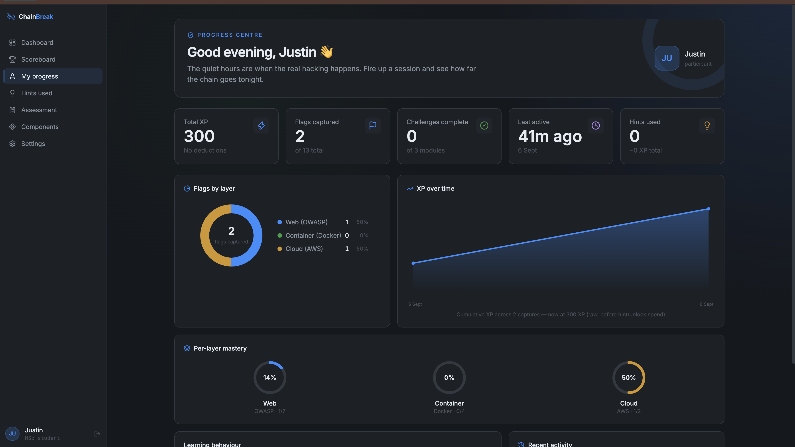
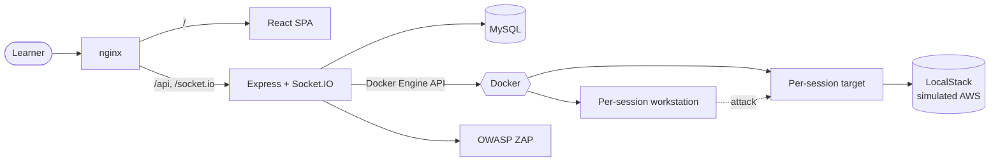

<div align="center">

# ⚡ ChainBreak

**A Dockerised, tri-layer cybersecurity CTF & research platform**

*Web exploitation → container escape → cloud misconfiguration — one continuous attack chain, in the browser.*

[](LICENSE)
[](server/package.json)
[](client/package.json)
[](docker-compose.yml)
[](https://dissertation.mercythira.com/)

[**Live Demo**](https://dissertation.mercythira.com/) · [Features](#-features) · [Quick Start](#-quick-start) · [Architecture](#-architecture) · [Challenges](#-the-challenges)

</div>

---

## 🌐 Live Application

**[https://dissertation.mercythira.com/](https://dissertation.mercythira.com/)**

<p align="center">
  
</p>

---

## 📖 About

ChainBreak is a self-hosted learning environment built around a single idea: real vulnerabilities rarely live in isolation. A SQL injection doesn't just leak a row, it can be the first link in a chain that ends with a compromised container and a raided cloud account.

Each challenge module walks a learner through that full chain:

```
🌐 Web exploitation  →  🐳 Container compromise  →  ☁️ Cloud misconfiguration
   (OWASP Top 10)         (privilege escalation,       (simulated AWS via
                           Docker escape)                LocalStack — S3, IAM, STS)
```

Learners work in a **real, isolated, disposable Docker environment** for every session — a browser-based terminal (backed by an actual PTY, not a simulation) attacks a purpose-built vulnerable target over a private per-session network. Progress, flags, AI-assisted hints, and research instruments (pre/post knowledge tests, confidence ratings, System Usability Scale) are all persisted for analysis.

Built as the practical component of a dissertation on cybersecurity education so alongside the game, there's a full research pipeline: consent management, assessment scoring, hint-usage analytics, and an admin-only OWASP ZAP security centre.

## ✨ Features

| | |
|---|---|
| 🎯 **Tri-layer attack chains** | Every module chains OWASP Top 10 web exploitation into a container escape into a simulated AWS breach not three disconnected puzzles. |
| 💻 **Real browser terminal** | `xterm.js` + `node-pty` + Docker `exec`, streamed over Socket.IO a genuine shell, not a canned simulation. |
| 🧩 **Per-session isolation** | Every learner gets a fresh target + workstation container pair on a private bridge network, provisioned and torn down automatically. |
| 🗺️ **Kill-chain visualisation** | A live React Flow graph tracks which stage of the attack chain has been compromised. |
| 🤖 **AI-assisted hints** | Context-aware hints via the Anthropic API, with a curated fallback bank when no key is configured. |
| 📊 **Research instruments** | Pre/post knowledge assessments, confidence self-ratings, and a standard SUS usability survey, scored server-side. |
| 🛡️ **Admin Security Centre** | Launch and review real OWASP ZAP scans against the platform from an admin-only dashboard. |
| 🏆 **Scoreboard & XP** | Live leaderboard, per-layer mastery tracking, and progress analytics. |
| ⏱️ **Session lifecycle** | Countdown timers with ending-soon warnings and automatic session teardown + redirect on timeout. |
| 🔐 **Consent-gated research flow** | Formal research consent capture, enforced both client- and server-side before any study content is reachable. |

## 🧱 Tech Stack

<table>
<tr><td><b>Frontend</b></td><td>React 19 · Vite · React Router · TanStack Query · Tailwind CSS · React Flow · xterm.js</td></tr>
<tr><td><b>Backend</b></td><td>Node.js 20 · Express 5 · Socket.IO · node-pty · JWT · bcrypt</td></tr>
<tr><td><b>Data</b></td><td>MySQL 8</td></tr>
<tr><td><b>Orchestration</b></td><td>Docker Engine API (Dockerode) · Docker Compose</td></tr>
<tr><td><b>Cloud simulation</b></td><td>LocalStack (S3, IAM, STS, Secrets Manager, Lambda)</td></tr>
<tr><td><b>Security tooling</b></td><td>OWASP ZAP</td></tr>
<tr><td><b>AI</b></td><td>Anthropic API (Claude)</td></tr>
<tr><td><b>Reverse proxy</b></td><td>nginx, with a Let's Encrypt/HTTPS production profile</td></tr>
</table>

## 🏗️ Architecture



Every session gets its own target + workstation container pair on a private, throwaway network, nothing is shared between learners. See [`ARCHITECTURE.md`](ARCHITECTURE.md) for the full, repository-verified reference.

## 🚀 Quick Start

### Prerequisites

- [Docker](https://docs.docker.com/get-docker/) & Docker Compose v2
- Node.js ≥ 20 (only needed if you want to run the client or server outside Docker)

### 1. Clone & configure

```bash
git clone https://github.com/ThiraTheNerd/Chainbreak.git
cd Chainbreak
cp .env.example .env
```

Open `.env` and fill in real values at minimum `JWT_SECRET`, `DB_PASS`, `DB_ROOT_PASS`. Every variable is documented inline in [`.env.example`](.env.example).

### 2. Launch the stack

```bash
docker compose up -d --build
```

This brings up nginx, the client, the API server, MySQL, LocalStack, and OWASP ZAP. First boot takes a minute while images build and MySQL initialises.

### 3. Seed demo data (optional)

```bash
docker compose exec server npm run db:seed
```

Creates a demo admin and a few participant accounts (see [`server/db/seed.js`](server/db/seed.js) for credentials) plus the seed challenge catalogue, local development only, not used on the live deployment.

### 4. Open it

**[http://localhost](http://localhost)**

### Running frontend/backend natively (hot reload)

Prefer editing without a rebuild? Run either side directly against the Dockerised MySQL:

```bash
# Frontend, with Vite HMR
cd client && npm install && npm run dev

# Backend, with --watch
cd server && npm install && npm run dev
```

## ⚙️ Environment Variables

All variables are documented with safe defaults in [`.env.example`](.env.example). Highlights:

| Variable | Purpose |
|---|---|
| `JWT_SECRET` | Signs session tokens set a long random value |
| `DB_HOST` / `DB_USER` / `DB_PASS` / `DB_NAME` / `DB_ROOT_PASS` | MySQL connection |
| `CLIENT_ORIGIN` | Allowed CORS origin for the API |
| `LOCALSTACK_URL` / `AWS_REGION` | Simulated AWS endpoint used by the cloud layer |
| `ZAP_API_KEY` | Auth key for the OWASP ZAP daemon |
| `ANTHROPIC_API_KEY` / `ANTHROPIC_MODEL` | Enables AI-generated hints |

## 🧭 Project Structure

```
Chainbreak/
├── client/                   React + Vite frontend
├── server/                   Express API, Socket.IO gateway, Docker orchestration
├── challenges/                Intentionally vulnerable challenge targets
├── nginx/                    Reverse proxy config (dev + production)
├── LocalStack/                Simulated-AWS bootstrap scripts
├── analysis/                  Research data pipeline (Python)
├── docker-compose.yml         Local development stack
├── docker-compose.prod.yml    Production override (SSL, hardened ports)
└── ARCHITECTURE.md            Full architecture reference
```

## 🎮 The Challenges

| Module | Layer 1 — Web | Layer 2 — Container | Layer 3 — Cloud |
|---|---|---|---|
| **Challenge 1** | SQL injection (auth bypass) | SSH key leak → credential pivot | AWS IAM key exfiltration |
| **Challenge 2** | IDOR (profile exposure) | Docker socket abuse | S3 bucket exfiltration |

Each flag captured unlocks the next stage of the kill chain. All targets are intentionally vulnerable, run in disposable containers, and are never reachable from outside their per-session network **do not deploy the challenge images outside this platform's isolation model.**

## 🧪 Testing

```bash
cd server && npm test   # server unit tests (node --test)
```

## ☁️ Deployment

Production runs on a hardened Docker Compose profile with HTTPS termination:

```bash
docker compose -f docker-compose.yml -f docker-compose.prod.yml up -d --build
```

Pushes to `main` deploy automatically via [GitHub Actions](.github/workflows/deploy.yml).

## 📄 License

Released under the [MIT License](LICENSE) © 2026 Mercy Thira.

---

<div align="center">

Built as the practical artefact of a cybersecurity education dissertation.

**[Try it live →](https://dissertation.mercythira.com/)**

</div>
